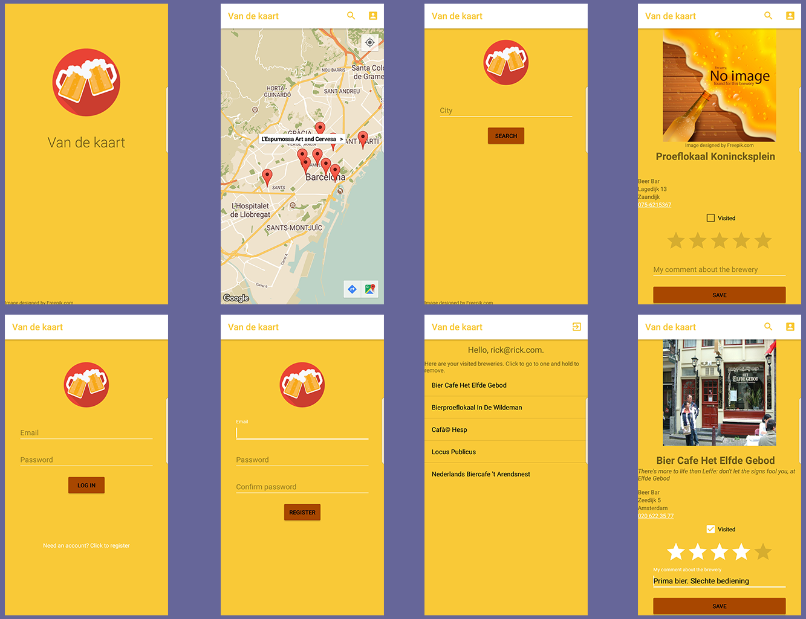

# Van de kaart

## Demo
[Demo](https://www.youtube.com/watch?v=8nFmK2DCCGI)

## Purpose
This app will show a map with breweries nearby in the city where the user is. The user can search for cities and see the breweries
in that city. Furthermore, the user can rate a brewery and he or she can save it when he or she is signed in. 
Saving the rating requires an account, which can be made in the app. The rating consists of a 5-star ratingbar and a comment.

## Sources of external images
The apps logo and standard brewery image are designed by Freepik. 
For further terms of use see [Freepik terms of use](https://www.freepik.com/terms_of_use).
All the content is located in drawable folder and in the mipmap folders.

Copyright © 2018, [Rick Bakker](https://github.com/rickbakker01).
Released under the [GNU GENERAL PUBLIC LICENSE](LICENSE.md).

## Screenshots

